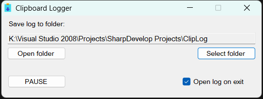

# Clipboard-Logger
Automatically save clipboard contents to text file.

Run program to start logging, close it to stop.
The program will start with a minimized window.
The clipboard will also be logged while select save folder dialog is open, this is to prevent losing data.

## Requirements
.NET Framework 4

